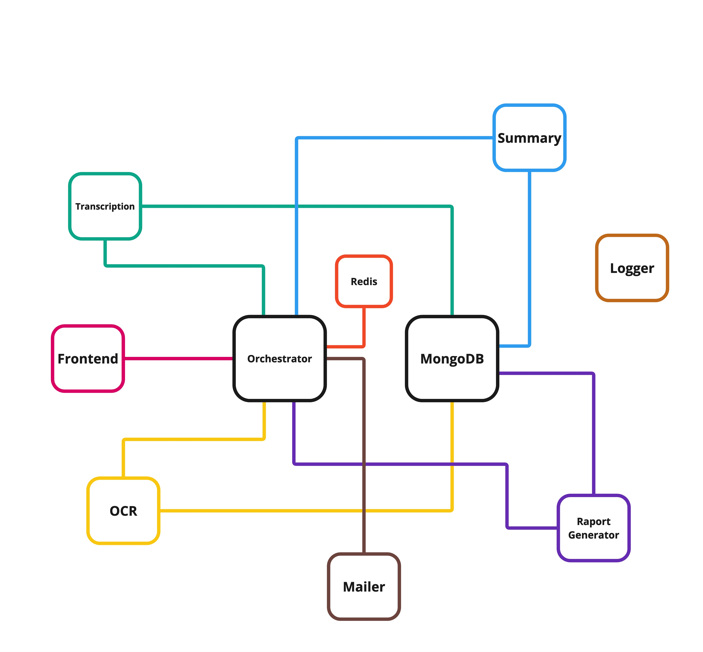

# System Architecture

The Meeting Report Generator employs a **microservices-based architecture** designed to ensure scalability, flexibility, and maintainability. Each service is specialized to handle a specific task, making the system modular and efficient.

## Architecture Overview

- **Frontend**:  
  A web interface that interacts with users, captures audio fragments for transcription, and uploads screenshots for OCR processing.

- **Backend**:  
  Composed of multiple microservices written in **Go** and **Python**, responsible for handling tasks, transcription, summarization, OCR, PDF generation, logging and sending emails.

- **Database (MongoDB)**:  
  Stores meeting transcriptions, embeddings, summaries, and OCR results for further analysis and reporting.

- **Redis**:  
  Acts as a temporary data store, maintaining the status of tasks and data about meeting.

### Architecture Diagram

Below is a visual representation of the system's architecture, highlighting the interactions between various components:

---

## Data Flow

The data flow in the system involves several coordinated steps to process user input, handle tasks across microservices, and generate a comprehensive meeting report. Below is a detailed step-by-step description:

### 1. Meeting Initialization
1. The user starts the application and provides their email.
2. The **Orchestrator** generates a `meeting_id` and:
   - Stores the user email in Redis under the key `meeting:meeting_id:email`.
   - Sets the initial meeting status to `started` in Redis with the key `meeting:meeting_id:status`.

---

### 2. Capturing Inputs
- **Audio**: The frontend captures audio in 5-minute fragments and sends them to the backend.
- **Screenshots**: The frontend detects changes on the user's screen and sends screenshots for OCR analysis.

---

### 3. Processing Audio
1. The Orchestrator receives audio files and:
   - Saves them to the shared volume `shared-transcription`.
   - Adds a task to Redis under `meeting:meeting_id:tasks` with status `pending`.
   - Sends the task to the **Transcription Service** via RabbitMQ on the `transcription_queue`.

2. The Transcription Service:
   - Processes the audio, identifying speakers and transcribing the content.
   - Saves the transcription in MongoDB in the `transcriptions` collection.
   - Updates or creates speaker embeddings in the `embeddings` collection for consistent speaker identification.
   - Sends an acknowledgment to the Orchestrator on the `orchestrator_ack_queue`.

---

### 4. Processing Screenshots (OCR)
1. The Orchestrator receives screenshots and:
   - Saves them to the shared volume `shared-ocr`.
   - Adds a task to Redis under `meeting:meeting_id:tasks` with status `pending`.
   - Sends the task to the **OCR Service** via RabbitMQ on the `ocr_queue`.

2. The OCR Service:
   - Processes the images using OCR models (e.g., OpenAI) to extract text.
   - Saves the OCR results in MongoDB in the `ocr_results` collection.
   - Sends an acknowledgment to the Orchestrator on the `orchestrator_ack_queue`.

---

### 5. Managing Tasks and Statuses
1. The Orchestrator listens for acknowledgments from all services.
2. It updates the task statuses in Redis to `completed`.
3. When the frontend indicates the meeting is complete (`meeting:meeting_id:status` set to `ended`) and all transcriptions are finished, the Orchestrator sends a task to the **Summary Service** on the `summary_queue`.

---

### 6. Generating Summaries
1. The Summary Service:
   - Fetches transcriptions from MongoDB.
   - Uses a language model (e.g., LLaMA or GPT) to generate a concise summary.
   - Saves the summary in MongoDB in the `summaries` collection.
   - Sends an acknowledgment to the Orchestrator on the `orchestrator_ack_queue`.

---

### 7. Generating Reports
1. After receiving the acknowledgment from the Summary Service and ensuring all OCR tasks are completed, the Orchestrator sends a task to the **Report Service** on the `report_queue`.
2. The Report Service:
   - Fetches all transcriptions, summaries, and OCR results from MongoDB.
   - Retrieves screenshots from the `shared-ocr` volume.
   - Generates a PDF report and saves it to the `shared-report` volume.
   - Sends an acknowledgment to the Orchestrator.

---

### 8. Sending the Report
1. The Orchestrator retrieves the user's email from Redis (`meeting:meeting_id:email`) and sends a task to the **Mailer Service** on the `email_queue`.
2. The Mailer Service:
   - Fetches the PDF report from the `shared-report` volume.
   - Sends the report to the user via email.
   - Sends an acknowledgment to the Orchestrator.

---

### 9. Cleaning Up
1. After receiving the acknowledgment from the Mailer Service, the Orchestrator:
   - Deletes all data related to the `meeting_id` from:
      - Shared volumes (`shared-transcription`, `shared-ocr`, `shared-report`).
      - MongoDB (transcriptions, summaries, OCR results, embeddings).
      - Redis (meeting metadata and tasks).

---

### Key Benefits of the Architecture

- **Scalability**: Independent microservices can be scaled as needed based on workload.
- **Flexibility**: Services are modular, allowing for easy updates or replacements.
- **Reliability**: Temporary data storage in Redis ensures that task states are maintained, even in the event of service interruptions.
- **Extensibility**: Additional services, such as analytics or advanced natural language processing, can be integrated without disrupting the existing workflow.

---

For a detailed explanation of each microservice, refer to the [Microservices Overview](microservices.md).
